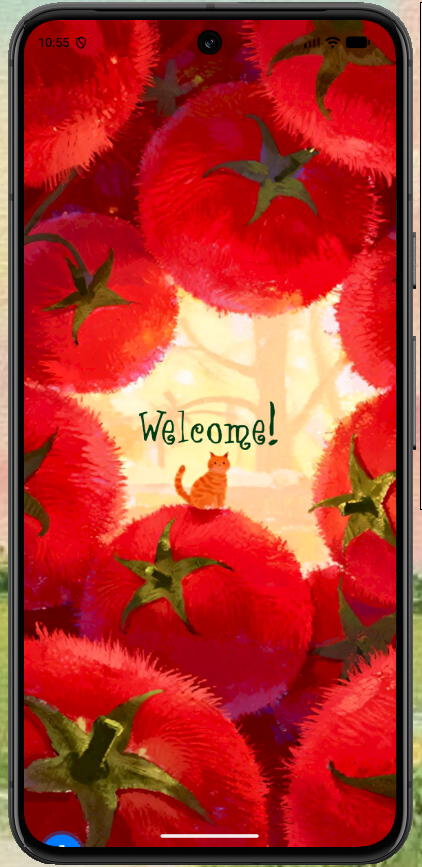
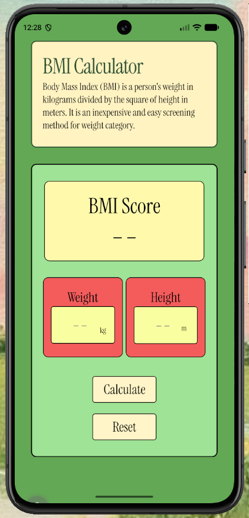
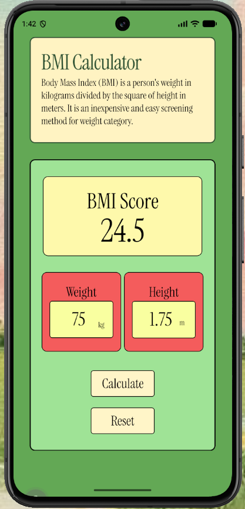

# Tomato Themed BMI Calculator ˗ˏˋ 🍅 ˎˊ˗

A vibrant, tomato-themed Body Mass Index (BMI) calculator built with React Native and Expo. 

This summer, I grew an insane amount of tomatoes. Inspired by the greens of the vines, the bright reds of the ripening fruit, and the yellow blossoms, I decided to channel that aesthetic into a mobile application. The result is a clean, functional BMI calculator wrapped in a playful, organic UI.

---

## Features

*   **Summer Tomato Aesthetic:** Carefully selected colour palette matching vine greens, tomato reds, and blossom yellows. It features the varying colours from germination to ripening.
*   **Greeting Screen:** A five-second welcome screen that greets users before they transition into the main calculator interface.
*   **Instant BMI Analysis:** Real-time on-screen score updates combined with detailed category alerts (Underweight, Normal, Overweight, Obesity).
*   **Input Validation:** Built-in validation limits (such as rejecting heights over 3 meters and weights under 0) to keep inputs realistic and accurate.
*   **Quick Reset:** A single-tap reset action to instantly clear all fields for the next calculation.

---

## Screenshots

| Greeting Screen | Default Calculator Screen | Calculation Example |
| :---: | :---: | :---: |
|  |  |  |

---

## Design Colour Palette Reference

The user interface pulls directly from the life cycle of a tomato plant:
*   #64a856 (Vine Green) : Main application background.
*   rgb(244, 92, 92) (Ripe Tomato Red) : Input container blocks.
*   rgb(254, 249, 171) (Blossom Yellow) : Scoreboard and input focus elements.

---

## Tech Stack and Dependencies

*   **Framework:** React Native (Expo Workflow)
*   **State Management:** React Hooks (useState)
*   **Typography:** expo-font loading custom serif typography (InstrumentSerif) and Angelica.
*   **Styling:** Native StyleSheet API using Flexbox layouts.
